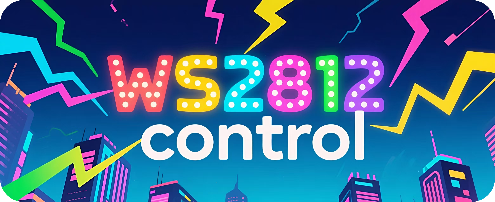
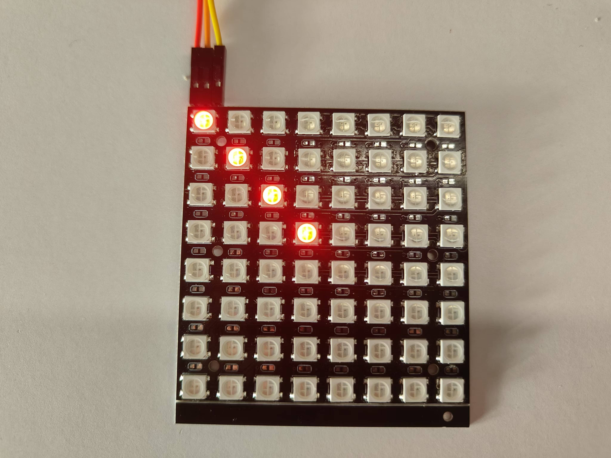

<h1 align="center">🏳️‍🌈 ESP32 WS2812 Control</h1>

<p align="center">
ws2812_control是一个专为ESP32设计的WS2812 LED控制组件<br/>
支持多种LED效果和矩阵/条形两种工作模式<br/>
提供丰富的API接口和可配置参数
</p>

<p align="center">
<a href="./README_EN.md">English</a>
· 简体中文
· <a href="https://github.com/NingZiXi/ws2812_control/releases">更新日志</a>
· <a href="https://github.com/NingZiXi/ws2812_control/issues">反馈问题</a>
</p>

<p align="center">
  <a href="LICENSE">
    
  </a>
  <a href="https://www.espressif.com/">
    
  </a>
  <a href="https://docs.espressif.com/projects/esp-idf/">
    
  </a>
  <a href="https://www.espressif.com/">
    
  </a>
  <a href="">
    
  </a>
  <a href="https://github.com/NingZiXi/ws2812_control/stargazers">
    
  </a>
</p>

---

## 概述

本项目提供了一个用于控制 WS2812 LED 灯条的库，适用于 ESP32系列微控制器。该库包含了多种效果，如呼吸、渐变、闪烁和彩虹效果，以及基本的开关功能。设计时考虑了模块化和易集成性，方便在其他项目中使用。

## 功能特性
- **支持WS2812矩阵屏**：除了普通WS2812驱动外还适用于创建多种排列和大小的 LED 矩阵。
- **HSV 到 RGB 转换**：提供了一个辅助函数，用于将 HSV 颜色空间转换为 RGB 颜色空间。
- **多种 LED 效果**：支持常亮、关闭、呼吸、渐入、慢闪、快闪和彩虹效果。
- **单个 LED 控制**：可以单独设置某个 LED 的颜色。
- **颜色宏定义**：预定义了多种常用颜色，如白色、绿色、红色、蓝色等。
- **模块化设计**：代码结构清晰，易于扩展和维护。

## 配置WS2812参数

在menuconfig中配置WS2812参数，进入menuconfig找到ws2812 config菜单，此配置菜单用于设置 WS2812 LED 的信号引脚和工作模式，工作模式包括条形模式（Strip mode）和矩阵模式（Matrix mode）。根据所选的模式，您还可以配置相关参数，在条形模式（Strip mode）下只需要配置 LED 的数量即可，而在矩阵模式（Matrix mode）下，您还需要配置以下参数：

1. **矩阵宽高**：设置矩阵中每行每列的 LED 数量。
2. **矩阵布局类型**：指定矩阵的布局类型和方向，以便灵活支持不同的安装方式。

配置完成后，保存并退出 `menuconfig`，即可按照设定的模式和参数控制 WS2812 LED，下面先以条形模式举例介绍的使用方法。

## 条形模式（Strip mode）使用方法
### 1. 创建 WS2812 控制句柄

首先，需要创建一个 WS2812 控制句柄，用于后续的 LED 控制操作。

```c
ws2812_strip_t* WS2812=ws2812_create();
```

### 2. 设置 LED 效果

可以通过调用 `ws2812_set` 函数来设置 LED 的效果。例如，设置所有 LED 为常亮状态，颜色为红色：

```c
//方式1
ws2812_set(WS2812, COLOR_RED, LED_EFFECT_ON);
//方式2
led_set_on(WS2812,COLOR_RED);
//也可使用COLOR_RGB(255,0,0)来设置红色或自定义颜色
led_set_on(WS2812,COLOR_RGB(255,0,0));
```

### 3. 常用功能

- **设置单个 LED 颜色**：

  ```c
  led_set_pixel(WS2812, 0, COLOR_GREEN); // 设置第0个LED为绿色
  ```

- **关闭所有 LED**：

  ```c
  led_set_off(WS2812);
  ```

- **呼吸效果**：

  ```c
  //方式1
  ws2812_set(WS2812, COLOR_BLUE, LED_EFFECT_BREATH);
  //方式2
  led_set_breath(strip, COLOR_RGB(255, 0, 0), 10); // 红色呼吸
  ```

- **彩虹效果**：

  ```c
  //方式1
  ws2812_set(WS2812, COLOR_BLUE, LED_EFFECT_RAINBOW);
  //方式2
  led_set_rainbow(strip, 20); // 20ms间隔的彩虹效果
  ```


#### `ws2812_set()`第三个参数 模式可设置以下效果
>
    LED_EFFECT_ON             // 使LED灯常亮效果
    LED_EFFECT_BREATH,        // 使LED灯呼吸效果
    LED_EFFECT_FADE_IN,       // 使LED灯淡入效果
    LED_EFFECT_BLINK_SLOW,    // 使LED灯慢闪烁效果
    LED_EFFECT_BLINK_FAST,    // 使LED灯快闪烁效果
    LED_EFFECT_RAINBOW        // 使LED灯彩虹效果

需注意`ws2812_set()`的配置应用于所有灯珠

更多API请参考 [ws2812_control.h](include\ws2812_control.h) 文件

### 示例代码

以下是此库的示例代码，

```c
#include <stdio.h>
#include <ws2812_control.h>

void app_main(void){

    // 创建一个WS2812灯带
    ws2812_strip_t* WS2812=ws2812_create();
    
    //点亮灯带 颜色(255,0,0)
    led_set_on(WS2812,COLOR_RGB(255,0,0));
}
```

## 矩阵模式（Matrix mode）使用方法

矩阵模式（Matrix mode）的使用方法与条形模式（Strip mode）类似

```c
//创建ws2812矩阵控制句柄
ws2812_matrix_t* WS2812 = ws2812_matrix_create();

//设置第2行第2列的LED为红色
led_matrix_set_pixel(WS2812,2,2,COLOR_RGB(255,0,0));

//更新矩阵显示
led_matrix_show(WS2812);
```

### 示例代码


```c
#include <stdio.h>
#include <ws2812_control.h>

void app_main(void){

    //创建ws2812矩阵控制句柄
    ws2812_matrix_t* WS2812 = ws2812_matrix_create();

    //设置LED为红色
    led_matrix_set_pixel(WS2812,0,0,COLOR_RGB(255,0,0));
    led_matrix_set_pixel(WS2812,1,1,COLOR_RGB(255,0,0));
    led_matrix_set_pixel(WS2812,2,2,COLOR_RGB(255,0,0));
    led_matrix_set_pixel(WS2812,3,3,COLOR_RGB(255,0,0));

    //更新矩阵显示
    led_matrix_show(WS2812);
}
```

## 依赖项

- ESP-IDF >= 4.4.7 （最新IDF 5.3.1 经过测试可用）
- led_strip 灯条驱动库

## 许可证

本项目采用 MIT 许可证。更多信息请参阅 [LICENSE](LICENSE) 文件。

## 贡献

欢迎任何形式的贡献，包括但不限于代码改进、文档更新、问题反馈等。请通过 GitHub 提交 Pull Request 或 Issue。

## 作者

- 宁子希 (1589326497@qq.com)

## 版本历史

- 1.0.0 (2024-08-31)
  - 初始版本发布
- 1.1.0 (2024-10-31)
  - 增加跑马灯效果
- 1.2.0 (2024-11-26)
  - 增加矩阵模式
- 1.3.0 (2025-4-27)
  - 改进彩虹效果实现
  - 动画led效果改由定时器实现 
## 🤝 贡献
本项目采用 MIT 许可证，详情请参阅 [LICENSE](LICENSE) 文件。

<p align="center">
感谢您使用 ESP32 WS2812 Control！🌈<br/>
如果觉得项目对您有帮助，请给个 ⭐ Star 支持一下！
</p>